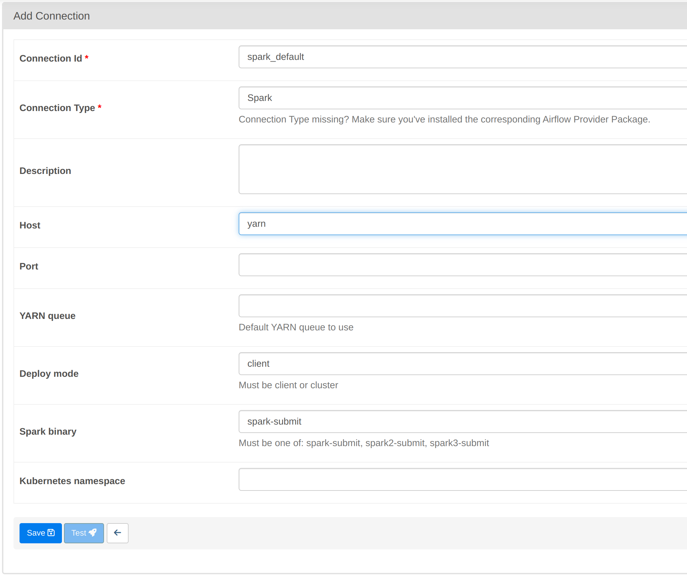
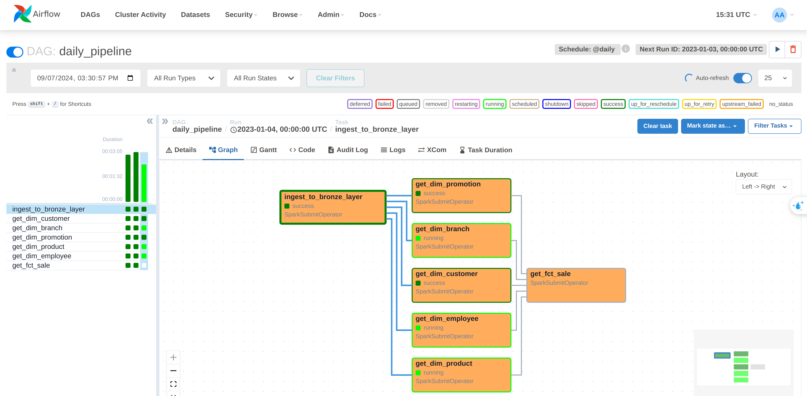

# Retail chain data pipeline for Analytics and Reporting


## Project Overview


## Prerequisites
- Docker
- Python 3.9 or later

## Technologies Used
- Python
- Airflow
- HDFS
- Spark
- Hive
- Metabase
- MySQL, Postgres

## Data Modeling

### Source database schema:


### Star Schema:


## Getting Started

### Infrastructure setup:

1. Clone project repository

```bash
git clone <link.com>
```

2. Navigate to project directory

```bash
cd RetailChainDatawarehouse
```

3. Build hadoopbase docker image
    
```bash
make build-hadoopbase
```

4. Start up infrastructure

```bash
make up && make setup
```

### Airflow Setup

Come to http://localhost:8081 to access Airflow web UI and login with:
* username: airflow
* password: airflow

Go to Admin -> Connections and create a new spark connection with the following values:



Come to Dags tab and click on the trigger button on `daily_pipeline` dag to run the pipeline. 



### Metabase Dashboard

Start Spark Thrift Server:

```bash
make start-thift
```

Come to http://localhost:4000 to access Metabase web UI and register new account.
    
Setup Spark Thrift Server connection to Metabase:

Access dashboad:


    

### Others Service
- Browser HDFS file:
    http://localhost:9870
- Spark History Server:
    http://localhost:18080
- Hadoop Yarn Web UI:
    http://localhost:8088
