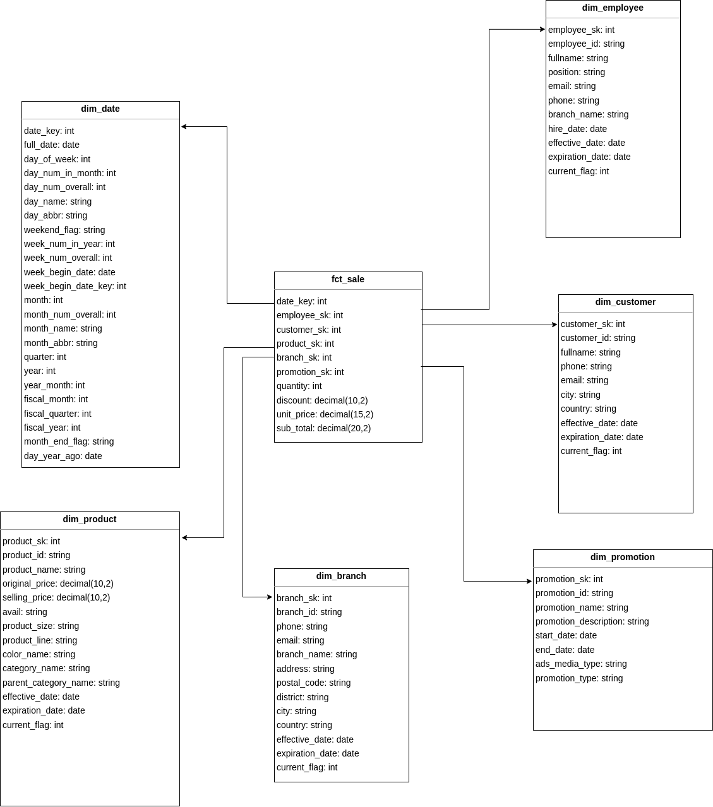

# Retail chain data pipeline for Analytics and Reporting


## Project Overview


## Prerequisites
Docker

## Technologies Used
- Python
- Airflow
- HDFS
- Spark
- Hive
- Metabase
- MySQL, Postgres

## Data Modeling

### Source database schema:


### Star Schema:



## Getting Started

1. Clone project repository

```bash
git clone <link.com>
```

2. Navigate to project directory

```bash
cd RetailChainDatawarehouse
```

3. Build hadoopbase docker image
    
```bash
make build-hadoopbase
```

4. Start up infrastructure

```bash
make up && make setup
```

5. Setup Airflow

    Come to http://localhost:8081 to access Airflow web UI and login with:
* username: airflow
* password: airflow

    Trigger the DAG

    Click on the `daily_pipeline` and click on the `Trigger DAG` button to start the DAG.
    
6. Setup Metabase Dashboard

    Come to http://localhost:4000 to access Metabase web UI and register new account.
    Setup Spark Thrift Server connection to Metastore:

    Access dashboad:
    
    
    
    

## Access Service

1. Airflow Web UI
    http://localhost:8081
2. Browser HDFS file
    http://localhost:9870
3. Spark History Server
    http://localhost:18080
4. Metabase Dashboard
    http://localhost:3000
