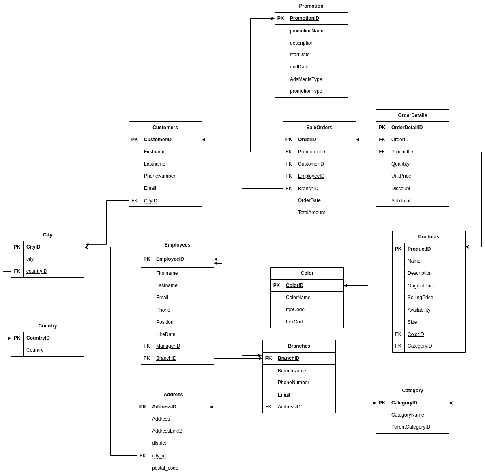

# Retail chain data pipeline for Analytics and Reporting


## Project Overview


## Prerequisites
Docker

## Technologies Used
- Python
- Airflow
- HDFS
- Spark
- Hive
- Metabase
- MySQL, Postgres

## Data Modeling

### Source database schema:



### Star Schema:


## Getting Started

1. Clone project repository

```bash
git clone <link.com>
```

2. Navigate to project directory

```bash
cd RetailChainDatawarehouse
```